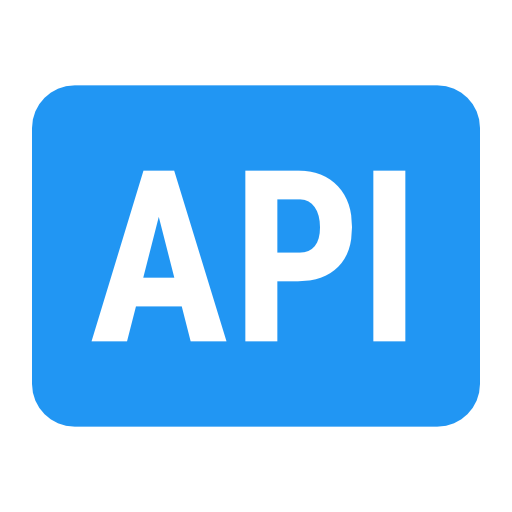

> ⚠️ Work in progress - Realne porównanie trzech podejść do testów API

<a href="https://aimeos.org/">
    
</a>

# Playwright API testing framework
<p align="right">
  <i align="center">Three robust architectural approaches 🚀</i>
</p>


<table width="100%">
  <tr>
    <td width="33%" valign="top">
      <h3 align="center"> Domyślnie</h3>
      <p align="center">Requesty wykonywane przez request / APIRequestContext w tym samym runnerze i kontekście co UI, z jego mechanizmami (fixtures, storageState, retry, timeouts, reporting).</p>
    </td>
    <td width="33%" valign="top">
      <h3 align="center"> Axios (HTTP client)</h3>
      <p align="center">Requesty wykonywane przez osobną bibliotekę HTTP, niezależnie od Playwrighta, więc autoryzacja, konfiguracja i obsługa timeoutów/retry są zarządzane oddzielnie.<br></p>
    </td>
    <td width="33%" valign="top">
      <h3 align="center"> Własny framework</h3>
      <p align="center">Własny klient opakowujący APIRequestContext, który centralizuje budowę requestów, walidację odpowiedzi i asercje, aby testy korzystały z jednego, spójnego interfejsu.<br><br></p>
    </td>
  </tr>
</table>


<br>

### Podejścia do testów API w Playwright

| Podejście | Plusy | Minusy | Zastosowanie |
|---|---|---|---|
| **APIRequestContext (wbudowane Playwrighta)** | Ten sam runner co UI • wbudowane `baseURL`, `storageState`, retry, trace, raporty • łatwe łączenie API + UI (seed/logowanie) | Mniej zaawansowanych funkcji manipulacji requestem niż dedykowane klienty HTTP | Start projektu: surowe requesty + proste helpery (`clients/`, `builders/`, `asserts/`); domyślne podejście dla testów wspierających UI |
| **Zewnętrzny klient HTTP (np. Axios)** | Interceptory i transformacje • bogaty ekosystem • można używać poza Playwrightem | Brak integracji z Playwright (trace, fixtures, reporting) • osobna konfiguracja auth/timeoutów • dodatkowa zależność | Tylko gdy potrzebne funkcje klienta HTTP lub współdzielenie testów/klienta poza Playwrightem |
| **Własna abstrakcja (Request Client/Handler)** | Czytelne testy („business language”) • mniej duplikacji • centralna konfiguracja requestów i asercji | Ryzyko przeabstrahowania • trudniejszy debug jeśli ukryje zbyt dużo | Gdy liczba testów rośnie: wprowadzenie fluent interface / request handler i centralizacji logiki requestów |


<br >

### Własnym framework do testów API
<details>

<summary>Wstęp</summary>
<br>

W Playwright testy API można pisać “niskopoziomowo” (bezpośrednio robiąc requesty), ale w większych projektach szybko pojawia się problem:
- dużo powtarzalnego kodu (URL, path, headers, params, body),
- testy stają się mało czytelne,
- konfiguracja requestów miesza się z logiką testu,
- trudno utrzymać spójny styl w zespole.

Własnym framework do testów API to koncepcje w której budujesz cienką warstwę abstrakcji nad wykonywaniem requestów (mini-framework). Pozwala to składać request “z klocków” i pisać testy bardziej deklaratywnie.

</details>

<details>

<summary>Co robimy</summary>
<br>

Budujemy własną warstwę abstrakcji (mini-framework) do testów API w Playwright, która pozwala opisywać zapytania HTTP w sposób deklaratywny i czytelny.

Zamiast pisać w testach “techniczne” szczegóły requestu w jednym miejscu, rozbijamy je na logiczne elementy (URL, path, parametry, nagłówki, body) i składamy je w formie łańcucha wywołań (fluent interface). Dzięki temu test zaczyna wyglądać jak opis żądania, a nie jak kod infrastrukturalny.

</details>

<details>

<summary>Dlaczego to robimy</summary>
<br>

W prawdziwych projektach testy API szybko rosną i wtedy pojawiają się problemy:
- duplikacja (ciągle te same fragmenty: baseURL, auth header, parametry),
- spadek czytelności (test miesza “co testujemy” z “jak robimy request”),
- trudniejsza konserwacja (zmiana np. autoryzacji wymaga edycji wielu testów),
- brak spójności (każdy pisze requesty trochę inaczej).

Ta warstwa abstrakcji przenosi “mechanikę” requestów do jednego miejsca, a w testach zostawia głównie intencję.

</details>

<details>

<summary>Oczekiwany rezultat</summary>
<br>

- Czytelniejsze testy – testy stają się bardziej opisowe, “self-documenting”.
- Mniej powtórzeń – konfiguracja requestów i wspólne elementy trafiają do jednej klasy/warstwy.
- Łatwiejsze zmiany – np. nowy header, token, baseURL, logowanie → poprawiasz raz, a nie w 50 miejscach.
- Standaryzację w zespole – każdy buduje requesty w tym samym stylu.
- Lepszą skalowalność suite testowej – gdy rośnie liczba endpointów i scenariuszy, struktura się broni.

</details>

<details>

<summary>Instrukcja - budowa własnego frameworka</summary>

### Krok 1: Stwórz builder requestów uywając Fluent Interface Design pattern
W pliku ```utils/request-handler.ts``` tworzysz klasę ```RequestHandler```, która zbiera (kolekcjonuje) parametry requestu z testu, zapisuje je w polach prywatnych, zwraca this z każdej metody, żeby umożliwić “łańcuchowanie” wywołań.

> [!NOTE]
> To podejście jest znane jako: Builder pattern (składanie obiektu krok po kroku) lub Fluent Interface Design (płynny interfejs, chaining)

### Krok 2: Dodaj fixture i wstrzykuj RequestHandler do testów
Utwórz bazowy plik z fixtures (```fixtures/base.fixtures.ts```), w którym bierzesz domyślny ```test``` z pw jako ```base```, a następnie rozszerzasz go o fixture. Dzięki temu ```RequestHandler``` nie jest już tworzony ręcznie w każdym teście.

### Krok 3: Zbuduj finalny URL (base + path + query params)
Dodaj ```RequestHandler``` metodę ```getUrl()``` (najlepiej jako metodę pomocniczą wewnątrz klasy), która składa kompletny adres endpointu na podstawie danych zebranych wcześniej w builderze: bierze ```baseUrl``` ustawiony w teście przez ```.url(...)``` albo (jeśli nie podasz) używa ```defaultBaseUrl```, dokleja ```apiPath``` ustawiony przez ```.path(...)```, zamienia ```queryParams``` podane przez ```.params({ ... })``` na string w formacie ```key=value&...```. W efekcie niezależnie od tego, czy w teście podasz ```.url(...)```, dostajesz zawsze poprawny, gotowy do użycia adres — a parametry query nie są “ręcznie klejone”, tylko generowane automatycznie.

### Krok 4: Dodaj konstruktor do RequestHandler
Dodaj do klasy RequestHandler konstruktor, który przyjmuje dwa wymagane parametry: ```request``` (czyli Playwrightowy ```APIRequestContext```) oraz ```baseUrl```. Konstruktor zapisuje te wartości w polach klasy, dzięki czemu handler ma dostęp do kontekstu wykonywania requestów oraz domyślnego adresu API. Od tego momentu ```RequestHandler``` jest w pełni przygotowany do wykonywania realnych wywołań HTTP, a nie tylko do budowania URL-i.

### Krok 5: Dodaj metodę get() która wykonuje request i usuwa „redundancję” z testów
Przenosisz z testów do frameworka wszystkie powtarzalne rzeczy związane z wysyłką GET-a: wykonanie requestu, walidację status code oraz automatyczne pobranie JSON-a z odpowiedzi. Dodajesz w RequestHandler nową metodę ```get()``` (lub ```getRequest()```), która buduje finalny URL przez ```getUrl()```, wysyła ```this.request.get(...)```, dołącza nagłówki tylko jeśli zostały zebrane przez ```.headers(...)```, a następnie sprawdza status po oczekiwanej wartości przekazanej jako argument (np. ```get(200)```). Na końcu metoda zwraca już gotowy obiekt JSON, więc w samym teście zostają tylko asercje na danych, a kod robi się krótszy, bardziej czytelny i łatwiejszy w utrzymaniu.

</details>

____

### Wnioski...
**Najpierw:** surowe request + proste helpery (clients/, builders/, asserts/)

**Potem** (gdy testów przybywa): fluent interface / request handler

**Axios:** tylko gdy musisz albo chcesz współdzielić klienta poza Playwrightem.